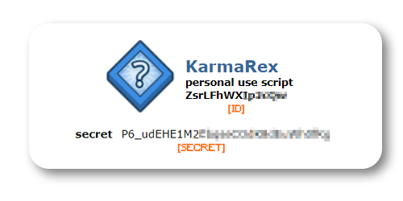

# Karma Rex: Gain Reddit Karma. Fast.

**Karma Rex** is a collection of _Python_ scripts which all share one purpose: gaining Reddit karma. We use **artificial intelligence** to post smart submissions and comments with your reddit account, that looks like they were posted by a regular Reddit user.

## Sections

[TOC]

## Get started

### Creating a Reddit app

**Karma Rex** uses the official Reddit API. To be able to use the Reddit API with your Reddit account, you must create an app!

1. Log into [reddit.com](reddit.com) with your account.

2. Go to your [app preferences](https://old.reddit.com/prefs/apps/#create-app-button), and click on "Create an app" or the "Create another app" button at the bottom of the page.

3. Fill out the "Create application" form. It doesn't matter what you fill inside it (except the "type" section in which you must select "script"). We recommend following the template:

    - Name: `KarmaRex`
    - Type: `Script`
    - Description: `A collection of Python scripts that gains you free Reddit karma, without doing a thing 🧡`
    - About URL: `https://github.com/RealA10N/KarmaRex`
    - Redirect URL: `https://github.com/RealA10N/KarmaRex`

4. Click on the "Create app" button. Your newly created app should now appear under the "Developed applications" section! 🥳

5. Copy the **ID** and **SECRET** of your app - you will need them later!
    

    
    

    _Note: You should NEVER share your client secret (exactly as you wouldn't share your password!)_
